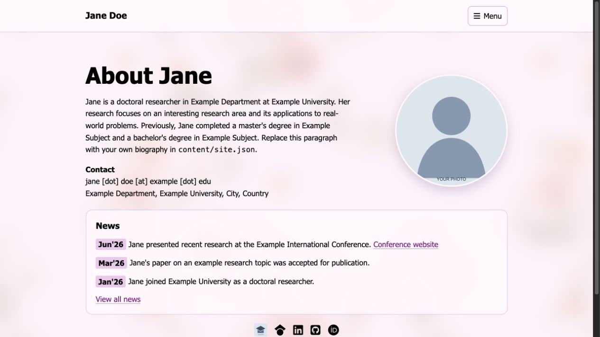
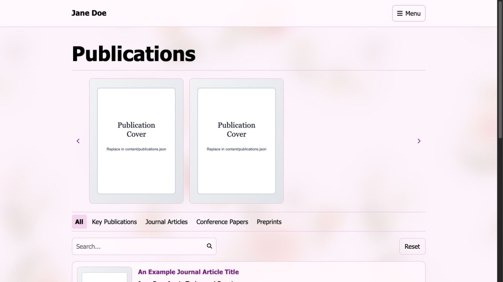
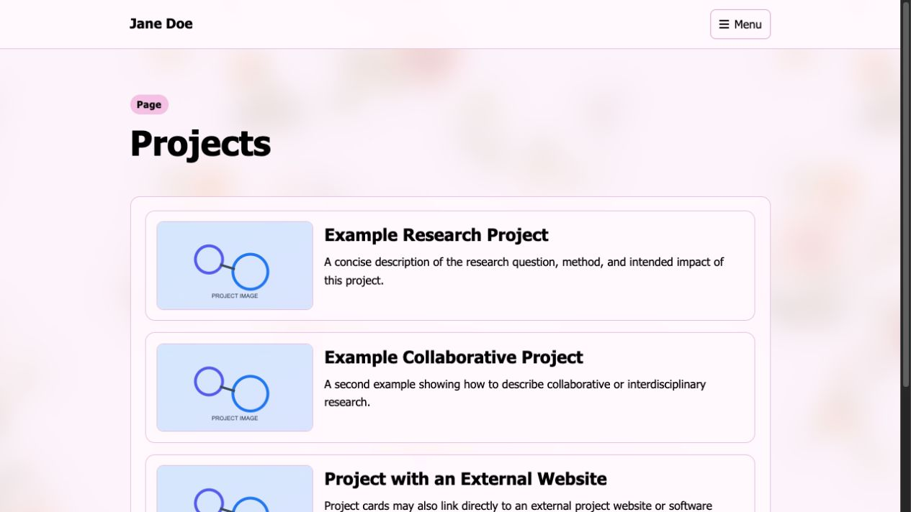
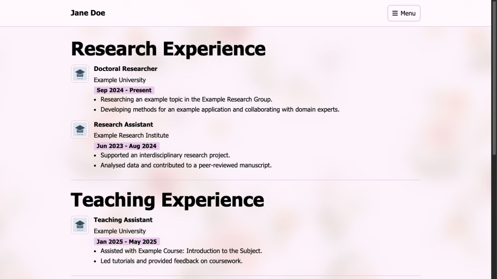

# Academic Website Template

Turn your CV, publications, projects, and research updates into a polished academic website—without learning a framework or maintaining a build system.



This responsive, data-driven portfolio is ready for GitHub Pages. Most customisation happens in a handful of readable JSON files: add your information, replace the sample images, and publish.

> **Plain HTML, CSS, and JavaScript. Free GitHub Pages hosting. No dependencies. No build step.**

## Why use this template?

- **Start with a complete academic site**, not a blank theme.
- **Update content without touching layouts** using files in `content/`.
- **Showcase research visually** with project cards and long-form project pages.
- **Help visitors find your work** through publication search, filters, links, and a featured carousel.
- **Keep your CV and news current** with simple structured entries.
- **Make it yours** by replacing the profile image and a single background file.

## Included

- Central profile and site settings
- Responsive navigation and accessible page structure
- Project cards with optional long-form detail pages
- Searchable and filterable publication list
- Key-publications image carousel
- Optional publication citation counts from OpenAlex when DOI links are supplied
- Chronological news feed with optional images, GIFs, and links
- JSON-driven CV sections
- GitHub Pages deployment
- Local live-reload development server

## Quick start

1. Click **Use this template** on GitHub and create a repository.
2. For a personal GitHub Pages site, name it `your-username.github.io`.
3. Clone your new repository.
4. Edit the files under `content/` and replace the example media under `assets/`.
5. Preview locally, then push your changes to GitHub.

```bash
npm run dev
```

Open [http://localhost:8000](http://localhost:8000). Do not open `index.html` directly with a `file://` URL because browsers block the JSON requests used by the site.

## See the sample site

The repository ships with a fictional Jane Doe profile so every feature is visible before you add your own content.

### Find and feature publications

Search, filter by publication type, highlight key work in the carousel, and attach publisher, PDF, code, or data links.



### Present projects clearly

Use compact project cards for quick scanning, then link to included long-form pages, demos, datasets, or external sites.



### Build a readable academic CV

Research, teaching, education, and awards are rendered from one structured JSON file.



## Repository layout

```text
.
├── assets/                  # Images, logos, PDFs, GIFs, and other user media
│   └── images/
├── content/                 # Primary user-editable JSON files
│   ├── site.json
│   ├── projects.json
│   ├── publications.json
│   ├── publications_tags.json
│   ├── news.json
│   └── cv.json
├── pages/                   # Secondary website pages
│   └── projects/            # Optional long-form project pages
├── site/                    # Website CSS and JavaScript
├── scripts/                 # Local development helper
├── index.html               # GitHub Pages entry point; keep at repository root
└── package.json
```

Most users only need to edit `content/` and `assets/`. The example values are ordinary text intended to be replaced directly.

## 1. Configure your identity and homepage

Edit `content/site.json`.

Important fields:

| Field | Purpose |
| --- | --- |
| `name` | Name shown in navigation, the footer, and browser titles |
| `short_name` | First or preferred name used by the homepage heading |
| `publication_name` | Full name as normally printed in publications |
| `citation_name` | Abbreviated name used on project pages if desired |
| `site_title` | Browser title for the homepage |
| `copyright_year` | Year shown in the footer |
| `attribution` | Footer credit and link to the original repository |
| `profile_image` | Repository-relative path to your profile image |
| `bio_html` | Homepage biography; links and basic HTML are supported |
| `contact` | Lines shown in the homepage contact block |
| `social_links` | University profile, Scholar, LinkedIn, GitHub, ORCID, or other links |
| `navigation` | Menu labels and repository-relative destinations |
| `pages` | Browser titles and meta descriptions for the main pages |

The included footer attribution reads “Adapted from mraoaakash/academic-website-template” and links to the template repository. Its wording and link are stored in the `attribution` object in `content/site.json`.

Replace `assets/images/profile-placeholder.svg` with your photograph, or upload a different image and update `profile_image`. Common formats such as `.jpg`, `.png`, `.webp`, and `.svg` work.

For social links, use an `icon` value from [Font Awesome](https://fontawesome.com/icons) or provide an `image` path for an institutional logo.

## 2. Replace the background

Upload your image to `assets/images/` using one of these filenames:

- `background.png`
- `background.jpg`
- `background.jpeg`

The site detects the available format automatically, so no CSS or JSON edits are required. If more than one exists, the priority is PNG, then JPG, then JPEG. A wide, high-resolution image with moderate contrast works best because the site adds colour and dark overlays for readability.

## 3. Add projects

Edit `content/projects.json`. Project cards appear in array order.

Each record supports:

```json
{
  "id": "project-unique-id",
  "title": "Project title",
  "summary": "One or two sentences describing the project.",
  "image": "assets/images/project-placeholder.svg",
  "image_alt": "Accessible description of the image",
  "url": "pages/projects/project-example-one.html"
}
```

The `url` may point to:

- A long-form page in `pages/projects/`
- An external project site beginning with `https://`
- A code repository, demo, dataset, or paper

To create another detail page, copy one of the example HTML files in `pages/projects/`, rename it, edit its contents, and use the new path in `content/projects.json`.

## 4. Add publications

Edit `content/publications.json`. Records are sorted by `created_at`, using a Unix timestamp in seconds.

```json
{
  "id": "unique-publication-id",
  "title": "Publication title",
  "content": "Author One, Your Name, Author Three",
  "link": "https://doi.org/10.xxxx/example",
  "publisher": "Journal or conference, year",
  "image": "assets/images/publications/your-cover.png",
  "tags": ["key_publications", "journal"],
  "buttons": [
    { "id": 1, "title": "Publisher", "link": "https://example.com" },
    { "id": 2, "title": "Code", "link": "https://github.com/your-username/repository" }
  ],
  "created_at": 1767225600,
  "updated_at": 1767225600
}
```

- Add `key_publications` to show an item in the top carousel.
- Add or rename filters in `content/publications_tags.json`.
- The publication image may be a custom cover or the included placeholder.
- When `link` or one of the buttons contains a DOI URL, the page attempts to retrieve a citation count from OpenAlex. Failure does not prevent publications from rendering.

## 5. Add news

Edit `content/news.json`. Entries are automatically sorted newest first. Dates use `YYYY-MM-DD`.

```json
{
  "date": "2026-06-15",
  "text": "Presented new research at an international conference.",
  "image": "conference-photo.jpg",
  "gif": "",
  "url": "https://example.com",
  "url_label": "Read more"
}
```

News images and GIFs belong in `assets/images/news/`. Use only the filename in `image` or `gif`. Leave optional values as empty strings when unused. The homepage shows the five newest entries; the News page shows the full feed and media.

## 6. Edit the CV

Edit `content/cv.json`. The outer array contains sections, and each section contains entries.

```json
{
  "title": "Research Experience",
  "entries": [
    {
      "title": "Doctoral Researcher",
      "organization": "Example University",
      "dates": "2024 - Present",
      "logo": "assets/images/institution-placeholder.svg",
      "logo_alt": "Example University logo",
      "flag": "GB-ENG",
      "flag_alt": "Country flag",
      "bullets": ["Describe your research responsibility or achievement."]
    }
  ]
}
```

The `flag` value uses a [Flagpack](https://flagpack.xyz/) country or subdivision code. Remove `flag` if you do not want to display one. The `bullets` field is optional.

## JSON editing rules

- Use double quotes around strings and field names.
- Separate records and fields with commas.
- Do not add a comma after the final item in an object or array.
- Keep image and internal page paths relative to the repository root.
- Validate JSON with a formatter or run:

```bash
for file in content/*.json; do python3 -m json.tool "$file" > /dev/null; done
```

## Local development

With automatic browser refresh (no npm installation required):

```bash
npm run dev
```

The default command uses the included Python reload server. The equivalent explicit command is:

```bash
npm run dev:reload
```

Using Python's basic server without automatic reload:

```bash
python3 -m http.server 9100
```

or:

```bash
npm run dev:simple
```

Then open [http://localhost:9100](http://localhost:9100).

## Deploy to GitHub Pages

### Personal site repository

1. Name the repository `your-username.github.io`.
2. Push the files to the `main` branch.
3. Open **Settings → Pages**.
4. Under **Build and deployment**, choose **Deploy from a branch**.
5. Select `main` and `/(root)`, then save.
6. Visit `https://your-username.github.io/` after GitHub finishes deployment.

### Project repository

You may also deploy from a repository with another name, such as `academic-website`. Select the same Pages settings and visit `https://your-username.github.io/academic-website/`. All internal links are resolved relative to the deployed site, so both deployment styles are supported.

## Customising the design

Site styles live in `site/styles.css`. The main design tokens are the CSS custom properties near the top of that file. Change those values to adjust colours, widths, shadows, and typography consistently. Font Awesome is loaded from a CDN in the HTML pages.

## Troubleshooting

### Content does not load

Serve the repository over HTTP; do not open the HTML files directly. Check the browser console and confirm every file in `content/` contains valid JSON.

### An image is missing

Check capitalisation and the full extension. GitHub Pages paths are case-sensitive. JSON image paths are relative to the repository root, while news media uses filenames from `assets/images/news/`.

### A project page returns 404

Confirm the `url` in `content/projects.json` exactly matches the file under `pages/projects/`.

### The publication carousel is empty

Add `key_publications` to the `tags` array of at least one publication.

## License

This template is available under the MIT License. See `LICENSE` for details.
